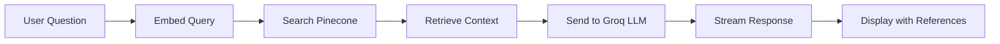

# Fumadocs AI Documentation

An AI-powered documentation site built with Next.js, Fumadocs, and integrated with RAG (Retrieval-Augmented Generation) for intelligent question answering.

## 🏗️ Architecture

### Core Technologies
- **Framework**: Next.js 16.0.1 with Turbopack
- **Documentation**: Fumadocs (UI + MDX)
- **LLM**: Groq (Llama 3.3 70B Versatile)
- **Vector Database**: Pinecone
- **Embeddings**: Xenova Transformers (all-MiniLM-L6-v2) - runs locally
- **UI Library**: React 19.2, Tailwind CSS 4.1

### How It Works



1. **User asks a question** in the Ask AI chat
2. **Query is embedded** using local Xenova transformer model
3. **Pinecone searches** for the 3 most relevant documentation chunks
4. **Context is sent** to Groq's Llama model with strict instructions to only use provided context
5. **Response is streamed** back to the user
6. **Reference links** to source documentation pages are appended

## 🚀 Getting Started

### Prerequisites
- Node.js 18+ installed
- Groq API key ([Get one here](https://console.groq.com/))
- Pinecone API key ([Get one here](https://www.pinecone.io/))

### Installation

1. **Clone the repository**
   ```bash
   git clone <your-repo-url>
   cd my-app
   ```

2. **Install dependencies**
   ```bash
   npm install
   ```

3. **Set up environment variables**
   
   Create a `.env` file in the root directory:
   ```env
   GROQ_API_KEY=your_groq_api_key_here
   PINECONE_API_KEY=your_pinecone_api_key_here
   ```

4. **Initialize the knowledge base**
   
   Run this command to index your documentation into Pinecone:
   ```bash
   npm run update-index
   ```

5. **Start the development server**
   ```bash
   npm run dev
   ```

6. Open [http://localhost:3000](http://localhost:3000) in your browser

## 📁 Project Structure

| Path | Description |
|------|-------------|
| `app/(home)` | Landing page and home routes |
| `app/docs` | Documentation layout and pages |
| `app/api/chat/route.ts` | **AI chat API** - handles RAG pipeline |
| `components/AskAI.tsx` | **Chat UI component** with markdown rendering |
| `content/docs/` | **Your documentation** (MDX files) |
| `lib/source.ts` | Content source adapter |
| `scripts/ingest.js` | **Indexing script** for Pinecone |
| `.github/workflows/` | CI/CD automation |

## 🤖 AI Chat Features

- **Context-aware**: Only answers from your documentation
- **Streaming responses**: Real-time response generation
- **Clickable references**: Links to source documentation pages
- **Vector search**: Fast semantic search using embeddings

## 🔄 Updating Documentation

When you add or modify documentation files:

1. **Manual update**:
   ```bash
   npm run update-index
   ```

2. **Automatic update** (via GitHub Actions):
   - Push changes to `main` branch
   - GitHub Actions automatically re-indexes on changes to `content/docs/`

## ⚙️ CI/CD - GitHub Actions

### Workflow Configuration

Create `.github/workflows/update-index.yml`:

```yaml
name: Update Knowledge Base

on:
  push:
    branches:
      - main
      - master
    paths:
      - 'content/docs/**'

jobs:
  update-index:
    runs-on: ubuntu-latest
    steps:
      - uses: actions/checkout@v4
      
      - name: Setup Node.js
        uses: actions/setup-node@v4
        with:
          node-version: '18'
          cache: 'npm'
          
      - name: Install dependencies
        run: npm ci
        
      - name: Update Index
        run: npm run update-index
        env:
          PINECONE_API_KEY: ${{ secrets.PINECONE_API_KEY }}
```

### Setup Steps

1. Go to your GitHub repository **Settings**
2. Navigate to **Secrets and variables** > **Actions**
3. Add repository secret: `PINECONE_API_KEY`
4. Push changes to trigger the workflow

## 📝 Available Scripts

| Command | Description |
|---------|-------------|
| `npm run dev` | Start development server |
| `npm run build` | Build for production |
| `npm start` | Start production server |
| `npm run update-index` | Re-index documentation to Pinecone |
| `npm run types:check` | Run TypeScript type checking |

## 🎨 Customization

### Adding New Documentation

1. Create a new `.mdx` file in `content/docs/`
2. Add frontmatter:
   ```yaml
   ---
   title: Your Page Title
   description: Page description
   ---
   ```
3. Run `npm run update-index` to make it searchable by AI

### Modifying System Prompt

Edit `app/api/chat/route.ts` at line ~45 to change how the AI responds.

## 🔧 Configuration Files

- `source.config.ts`: MDX and frontmatter schema configuration
- `next.config.mjs`: Next.js configuration
- `tsconfig.json`: TypeScript configuration
- `tailwind.config.ts`: Tailwind CSS configuration

## 📚 Learn More

- [Next.js Documentation](https://nextjs.org/docs)
- [Fumadocs](https://fumadocs.dev)
- [Groq Documentation](https://console.groq.com/docs)
- [Pinecone Documentation](https://docs.pinecone.io/)

## 🤝 Contributing

When contributing:
1. Add/update documentation in `content/docs/`
2. Run `npm run update-index` locally to test AI responses
3. Ensure AI provides accurate answers before pushing
